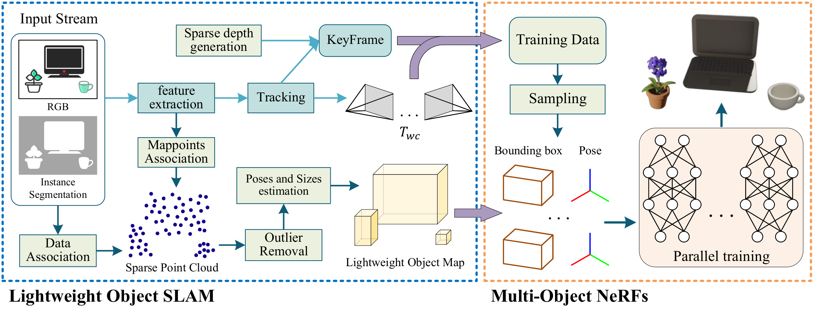

# RO-MAP

<center class="half">
    
    
</center>

**[Paper](https://arxiv.org/abs/2304.05735) | [Video](https://www.youtube.com/watch?v=sFrLXPw40wU)** 

# Overview

RO-MAP consists of two parts, including an object SLAM based on [ORB-SLAM2](https://github.com/raulmur/ORB_SLAM2) and a Multi-Object NeRF system based on [tiny-cuda-nn](https://github.com/NVlabs/tiny-cuda-nn). The two are decoupled, and the multi-object NeRF system is compiled into a dynamic link library, which provides interfaces for **offline** and **online** operation. Its code is located at:

```bash
 ./dependencies/Multi-Object-NeRF/Core
```



# License

This repo is GPLv3 Licensed (inherit ORB-SLAM2). The Multi-Object NeRF system based on [tiny-cuda-nn](https://github.com/NVlabs/tiny-cuda-nn) (BSD 3-clause license). Our implementation refers to [instant-ngp](https://github.com/NVlabs/instant-ngp) (Nvidia Source Code License-NC) and uses its marching cubes algorithm directly.

# Prerequisites

Our prerequisites include [ORB-SLAM2](https://github.com/raulmur/ORB_SLAM2) and [tiny-cuda-nn](https://github.com/NVlabs/tiny-cuda-nn) requirements. If you encounter compilation problems, please refer to their issues first.

* [Eigen3](http://eigen.tuxfamily.org) (test version: 3.4.0)
* [OpenCV](http://opencv.org) (test version: 3.4.16)
* [Pangolin](https://github.com/stevenlovegrove/Pangolin) (test version: 0.8)
* [CMake](https://cmake.org/) (test version: 3.25)

* [CUDA](https://developer.nvidia.com/cuda-toolkit) (test version: 11.8)

Test system: ubuntu (docker) 20.04, GPU: RTX 4090

# Building

Begin by cloning this repository and all its submodules using the following command:

```bash
git clone --recursive https://github.com/XiaoHan-Git/RO-MAP.git
cd RO-MAP
```

Then, build the multi-object NeRF system:

```bash
cd dependencies/Multi-Object-NeRF
sh build.sh
```
Finally, return to the main path and build RO-MAP:

```bash
cd ../../
sh build.sh
```

# Examples

### Dataset

We provide the dataset used in our paper.

* synthetic sequence [room](https://drive.google.com/file/d/1QSEgm4hcKkFA62VZaRZa-4epQ67suwdJ/view?usp=sharing) (including blender files, which come from the [Cube Diorama Dataset](https://github.com/jc211/nerf-cube-diorama-dataset)).
* two collected real-world sequences [scene1](https://drive.google.com/file/d/17aBLmPXvM8tsuL7K9BbgNHt-pOy-rncM/view?usp=sharing), [scene2](https://drive.google.com/file/d/1XCfKzlhcgcJnPu9MoQlNVdXXC3zdddCq/view?usp=sharing).

Please note that due to experimental conditions, the real-world sequences cannot be used for quantitative analysis.

### Offline Multi-Object NeRF

The offline version is only available to the synthetic sequence. **It is recommended to verify the offline version first.**

```bash
cd dependencies/Multi-Object-NeRF
# Specify which GPU to use (one or two are recommended)
export CUDA_VISIBLE_DEVICES=0
# Since the visualization is implemented using OpenGL, set the environment variable to make it run on the GPU.
__NV_PRIME_RENDER_OFFLOAD=1 __GLX_VENDOR_LIBRARY_NAME=nvidia ./build/OfflineNeRF ./Core/configs/base.json [path_to_sequence] [Use_GTdepth(0 or 1)]
```

### Online RO-MAP

Execute the following command: 

```bash
# Specify which GPU to use (one or two are recommended)
export CUDA_VISIBLE_DEVICES=0, 1
# Since the visualization is implemented using OpenGL, set the environment variable to make it run on the GPU.
__NV_PRIME_RENDER_OFFLOAD=1 __GLX_VENDOR_LIBRARY_NAME=nvidia ./examples/Monocular/mono_tum ./vocabulary/ORBvoc.bin ./dependencies/Multi-Object-NeRF/Core/configs/base.json [path_to_sequence]
```
If the GPU performance is relatively low, you can try to reduce the number of iterations:
```
path_to_sequence/config.yaml -> NeRF.TrainStepIterations : 500 ↓ 
```
**Note:** Due to the randomness of the multi-threading and outlier removal algorithm, sometimes the estimated 3D bounding box of objects may deviate significantly. You can run it several times.


# Acknowledgments

We thank [Jad Abou-Chakra](https://github.com/jc211) for his support on the dataset. Many thanks to the following brilliant works! 

* SLAM: **[ORB-SLAM2](https://github.com/raulmur/ORB_SLAM2)**, **[CubeSLAM](https://github.com/shichaoy/cube_slam)**, **[EAO-SLAM](https://github.com/yanmin-wu/EAO-SLAM)**

* NeRF: **[instant-ngp](https://github.com/NVlabs/instant-ngp)**, **[ngp_pl](https://github.com/kwea123/ngp_pl)**

# Citation

If you found this code/work to be useful in your own research, please considering citing the following:

```bibtex
@ARTICLE{RO-MAP,
  author={Han, Xiao and Liu, Houxuan and Ding, Yunchao and Yang, Lu},
  journal={IEEE Robotics and Automation Letters}, 
  title={RO-MAP: Real-Time Multi-Object Mapping With Neural Radiance Fields}, 
  year={2023},
  volume={8},
  number={9},
  pages={5950-5957},
  doi={10.1109/LRA.2023.3302176}
}
```

